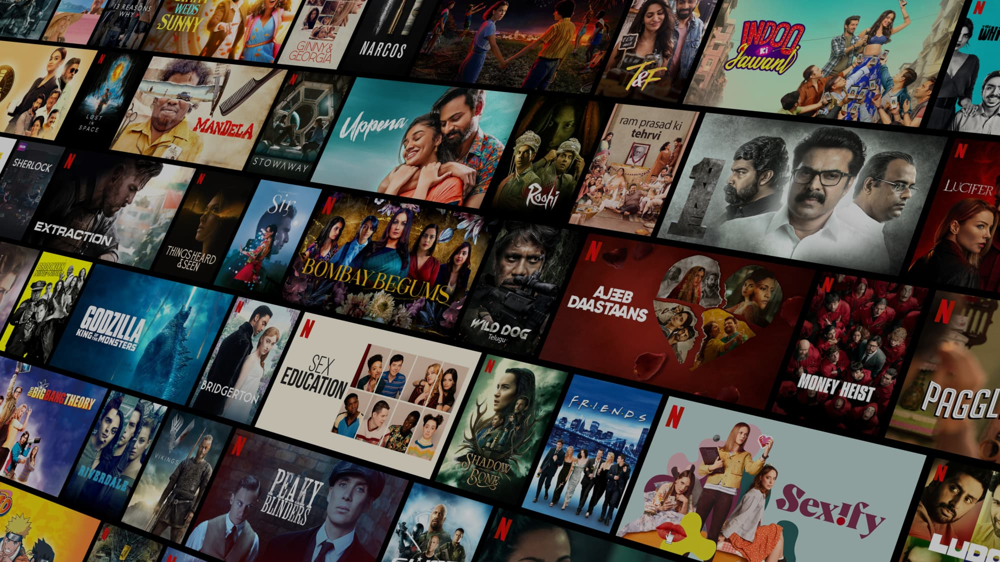

# CSS Concepts Tutorial README - Backup Before Full Update

A comprehensive collection of **browser-ready HTML demos** showcasing core CSS concepts: selectors, background properties, borders/outlines, fonts, colors, and practical layouts. Perfect for visual learning!

No setup required! Open any `.html` file directly in your browser.

## Quick Start

```bash
# Windows
start index.html

# Or drag any .html file to your browser
```

## All Demos

### Selectors (7)
| Demo | Description |
|------|-------------|
| [Element Selector](Element%20Selector.html) | Target elements by tag name |
| [ID Selector](ID%20Selector.html) | Unique elements by `#id` |
| [Class Selector](Class%20Selector.html) | Multiple elements by `.class` |
| [Universal](Universal.html) | `*` selects all elements |
| [Pseudo-class Selector](Pseudo%20class%20Selector.html) | `:hover`, `:visited` states |
| [Attribute selector](Attributeselector.html) | `[attr]`, `[attr=value]` |
| [Descendent](Descendent.html) | Nested targeting (e.g., `div p`) |

### Background Properties (6)
| Demo | Description |
|------|-------------|
| [Background Color](CSS%20Poperty%20Background%20color.html) | `background-color` basics |
| [Background Image](CSS%20Poperty%20Background%20image.html) | `background-image` usage |
| [Bg Repeat](Bg-Repeat.html) | `background-repeat` control |
| [Bg Position](Bg-Position.html) | `background-position` alignment |
| [Bg Size](Bg-Size.html) | `background-size` scaling |
| [Bg Attachment](Bg-Attachment.html) | `background-attachment: fixed/scroll` |

### Borders & Outlines (4)
| Demo | Description |
|------|-------------|
| [Border](Border%20property.html) | `border` styles, width, color |
| [Border Radius](Border%20Radius.html) | Rounded corners |
| [Outline Offset](Outline%20offset%20Property.html) | `outline-offset` spacing |
| [RGB Colors](RGB.html) | RGB/gradient color demos |

### Fonts & Text (8)
| Demo | Description |
|------|-------------|
| [Font Family](font%20family.html) | `font-family` (system + Google Fonts) |
| [Font Size](font-size.html) | `font-size` units and scaling |
| [Text Align](Text%20Allign.html) | Text alignment |
| [Text Shadow](Texttshadow.html) | `text-shadow` effects |
| [Letter Spacing](Letter%20Spacing%20Property.html) | Character spacing |
| [Text Transform](Text%20Transform%20Property.html) | Uppercase, lowercase, capitalize |

### Display, Positioning & Layout (15+)
| Demo | Description |
|------|-------------|
| [Display Property](Display%20Property.html) | `display: block/inline/flex/grid` |
| [Visibility](Visibility%20Property.html) | `visibility: hidden/visible` |
| [Center Image](Center%20image%20in%20htm%20document%20.html) | Centering techniques |
| [Position Property](Position%20Property.html) | `position: static/relative/absolute/fixed/sticky` |
| [Position Relative](Position%20Relative.html) | Relative positioning |
| [Position Absolute](Position%20Absolute%20.html) | Absolute positioning |
| [Position Sticky](Position%20sticky.html) | Sticky elements |
| [Z Index](Z%20Index.html) | Stacking order |
| [Flex Wrap](Flex%20Wrap.html) | Flexbox wrapping |
| [Display Grid](Display%20Grid.html) | CSS Grid basics |
| [Grid Property](GRid%20property.html) | Grid layout properties |

### Practical Projects & Demos (15+)
| Demo | Description |
|------|-------------|
| [Navigation](Navigation.html) | Navigation menu |
| [Players Card](Players%20Card.html) | Sports player cards |
| [Movie Poster](Movie%20Poster.html) | Movie poster layout |
| [Burger Cafe](Burger%20Cafe.html) | Restaurant UI |
| [Gradient Linear](Gradient%20Property.html/Linear_Gradient.html) | Linear gradients |
| [Gradient Radial](Gradient%20Property.html/Radial_Gradient.html) | Radial gradients |
| [Gradient Conic](Gradient%20Property.html/Conic_Gradient.html) | Conic gradients |
| [Restaurant Menu](Restaurant%20Menu.html) | Menu design |
| [Breakfast](Breakfast.html) | Food menu |
| [Hotel Login](Hotel%20Login.html) | Login form |
| [Table](Table.html) | Styled data table |
| [Profilecard](Profilecard.html) | User profile card |
| [Resume](Resume.html) | Professional resume |
| [Assignment](Assignment.html) | Assignment layout |
| [Loginpage](Loginpage.html) | Full login page |
| [Visiting card](Visiting%20card.html) | Business card |

### Entry Points
- [index.html](index.html) - Main landing (styled by index.css)
- [index2.html](index2.html) - Alternative homepage

## Screenshots & Assets




## Features
- ✅ **Pure HTML/CSS** (no JavaScript)
- ✅ **Interactive demos** with real-world examples
- ✅ **Self-contained files** - instant preview
- ✅ **Progressive complexity**: Basics → Advanced layouts
- ✅ Responsive-ready examples

## Contributing
1. Add new CSS property demos (name files descriptively, e.g., `Flexbox.html`)
2. Improve existing files
3. Fork → Edit → PR!

```bash
git clone <your-repo>
# Add your .html demo
git add .
git commit -m "Add Flexbox demo"
git push
```

## License
MIT License - Use freely for learning/projects!

---

*Built with ❤️ for CSS learners. Last updated: All files included.*
